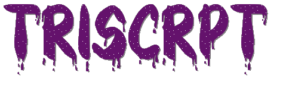

# 

## Welcome to My Coding Journey

Hello there! I'm Liam Stacey (trisrpt), and this is my GitHub portfolio—a digital space where I will showcase my abilities in software development. Here, you'll find a selection of my projects, code samples, software, giving you a glimpse into my skills, passion, and journey in programming.

### About Me

I am a passionate software developer who's always seeking opportunities to learn, create, and innovate. My journey in the world of coding began when I was still a child using Scratch, and since then, I have been constantly honing my skills, and tackling exciting challenges.

### What You'll Find in My Portfolio

#### Projects

Within this portfolio, you'll discover a range of projects I've worked on. For now, they will be focused around C# as that is my most studied language and is what I studied in college. However, I hope to soon expand on this to demonstrate my adaptability and a wider range of skills.

#### Code Samples

In the "Code Samples" section, I've provided snippets from some of my favorite projects. These code snippets are a reflection of my coding style and best practices. Feel free to explore them to get an idea of my coding abilities.

### Connect with Me

I'm always open to collaboration, learning, and networking. Please feel free to reach out to me via the following channels:

- **Email**: [liam.stacey05@gmail.com](mailto:liam.stacey05@gmail.com)
- **Socials**:
>  

Thank you for visiting my GitHub portfolio. I'm excited to continue growing, learning, and coding, and I hope you find something here that inspires you. Whether you're a fellow developer, a potential employer, or just someone who's interested in my work, let's connect!
